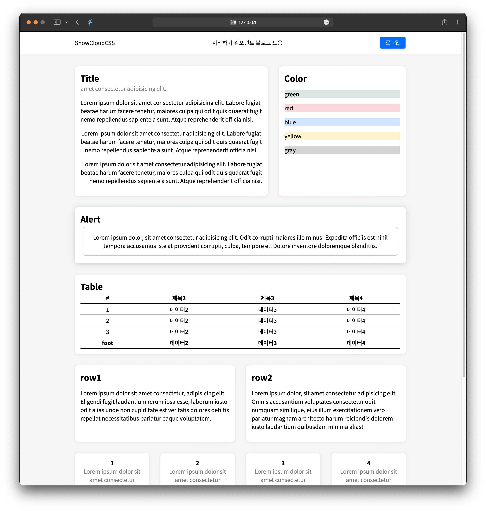

<div align="center">
    
    <br />
    <b>Snowcloud CSS</b>
    <br />
    
    <br>
    
    
    <p>하얀 눈구름 같이 맑고 깨끗한 UI/UX를 제공하는 프레임워크입니다.</p>

</div>

## Snowcloud

가볍고 빠르게 작동하고 쉽게 배워 적용할 수 있는 HTML, CSS, JavaScript 웹 프레임워크입니다. 모바일, 태블릿, PC 등 모든 디바이스를 지원하며 쉽게 Web Application의 디자인을 설계할 수 있습니다.

- 눈 덮인 산의 아름다운 경관 그대로 닮아 자연스러운 UI/UX를 제공합니다.
- 복잡한 동작을 추상화하여 간단한 코드로 쉽게 사용할 수 있습니다.

## Installation

- Style Sheet : 파일 다운로드 없이 스타일시트 추가하여 바로 사용할 수 있습니다.

```
<link href="https://static.gwansik.dev/snowcloudcss/snowcloud.css" rel="stylesheet"/>
```

- Download : 컴퓨터에 다운로드하여 설치합니다.

```
1. 우측 상단의 Code 버튼을 누르고 Download ZIP 버튼을 눌러 파일을 다운로드합니다.
2. 본인이 작업하는 파일에 다운로드 한 파일을 복사합니다.
3. index 파일에 snowcloud.css 파일을 스타일 시트로 추가합니다.
```

## Screenshot

<div align="center">
    
</div>
